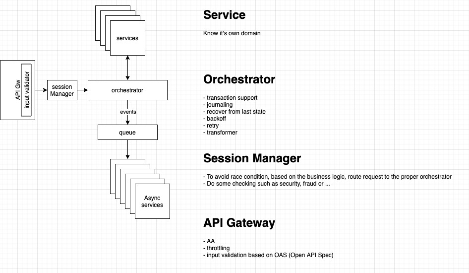

# orchestrator
Orchestrator is a platform to handle process chain. each chain can be "transactional" or "none transactional"
basically, chain is transaction (has process and failed handlers) if the state is not transaction the developer can implement an empty function for failure handler

the main functionality:
- [X] Statemachine
- [X] Support Transactional/Non-Transactional operation flow
- [X] Error handling
- [X] Hierarchical statemachine
- [X] Customizable error handling
- [ ] Route execution timeout

Not support
- Load balancing
- Endpoint service registration
- Endpoint service health-check

## Library
1- Distributed IMDG

2- http client with backoff handling
- Strategy Supported
    - Exponential
    - Fixed
- Creating Your Own Strategies

3- circuit breaker

### References
- https://www.commonwl.org/
- https://github.com/common-workflow-language/common-workflow-language
- https://camel.apache.org/
- https://kislayverma.com/software-architecture/architecture-pattern-orchestration-via-workflows/